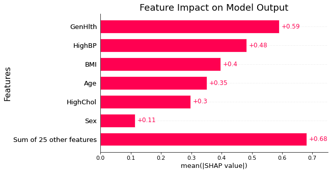

#  Diabetes Classification for County Health Department


**Author:** Benjamin Toler

## Overview
This project uses machine learning classification algorithms to predict whether a person has diabetes, as well as determine what are some of the most important features related to diabetes. A XGBoost model built using CDC survey data from 2015 predicts whether a person has diabetes with a 75% accuracy and 80% recall. The model determined general health, blood pressure, and BMI to be the most important features in predicting diabetes. This information can be used to inform guidance for future public health efforts.

## Business Problem
The local health department wants to address the prevalence of diabetes in their community. A classification model for diabetes can predict which people are at risk as well as identify key risk factors that can be addressed with targeted health interventions.

## Data
This project uses 2015 survey data from the CDC's Behavioral Risk Factor Surveillance System. The dataset contains information about the health and lifestyle of 72,692 people. The target variable in this dataset is a binary with values of 1 meaning a person is pre-diabetic or diabetic and 0 meaning they are not pre-diabetic or diabetic.

## Method
The analysis uses classification algorithms to predict a binary diabetes variable. Iterating through multiple classification algorithms, XGBoost was determined to be the optuimal model based on accuracy and recall scores.

## Results
The final XGBoost model has a 75% accuracy and 80% recall.

The final model included 31 predictor variables. Of those, general health, high blood pressure, and BMI were the three most significant predictors of diabetes.



## Conclusions
- **Health Department should provide survey on their website:** 
- **Start program :**
- **s:** 

## Next Steps
- **Search for addition data to add to model to improve model scores:** 
- **:** 
- **:** 

## For More Information

See the full analysis in the [Jupyter Notebook](./Diabetes_Classification.ipynb) or review this [presentation](./presentation.pdf).

For additional info, contact Benjamin Toler at [bentoler22@gmail.com](mailto:alison.bentoler22@gmail.com)


## Repository Structure

```
├── data
├── images
├── .gitignore
└── Diabetes_Classification.ipynb
├── README.md
├── presentation.pdf